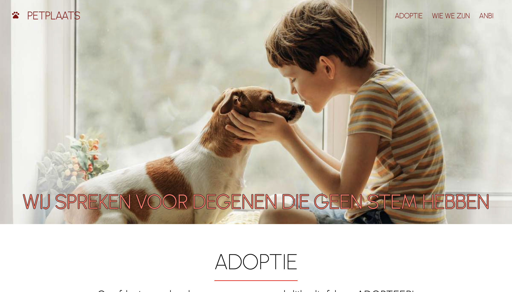

# PETPLAATS simple MERN website consisting of 9 pages (routes):

1. Homepage - gives a user an idea of what the website is about, about BARS organization, ability to get get more information about adoption, or getting involved in rescuing animals. It also gives three random profiles of animals currently waiting fo adoption. At the bottom of the page using 'NEEM CONTACT OP MET ONS' user can write at email to PETPLAATS.

2. Adoption page - gives a user adopting options: dogs and cats. By clicking on one of the option user will be redirected to the Pet List page, the list with animals from the chosen option. It also gives user full information about adoption procedure.

3. Pet List page - show the list of profiles (cats or dogs), user is able to filter animals according to their size, age and gender. By clicking on any profile, user is going to be redirected to Pet Details page.

4. Pet Details page - gives user information about the pet and ability to contact PETPLAATS.

5. Who We Are page - tells user what is the team of PETPLAATS, their mission and goals.

6. ABNI page - explains the objects of foundation and its policy.

7. Volunteer - gives user information about how to come a part of PETPLAATS and what kind of help the can contribute.

8. Donation page - gives user 6 options of donation. Each option explains what for donated money are gonna be used for. User can choose more than one option and checkout.

9. Foster - tells user what is needed from a user to become a foster parent.

# Demo:

Checkout test data:

Cart Number: 4242 4242 4242 4242

MM/YY: 12/23

CVC: 123

https://petplaats-test.herokuapp.com/

# Getting Started:

To get started you can simply clone the repo and install the dependencies in the root folder

Steps:

Install: npm install

Run: npm run dev

Runs the app in the development mode.

Open http://localhost:3000 to view it in the browser.

# Application:

ES6 + Features

Arrow Functions

Template Literals

Block-Scoped Variables Let and Const

async await with try/catch

Spread operator

Modules export/import

# Libraries/Frameworks

styled-components

materia UI icons

react-router-dom: The router components of react

axios: to make HTTP requests

nodejs: JS runtime for backend

express: server/web framework for nodejs to create server

mongoose: mongodb database library for nodejs

stripe-checkout: payment
